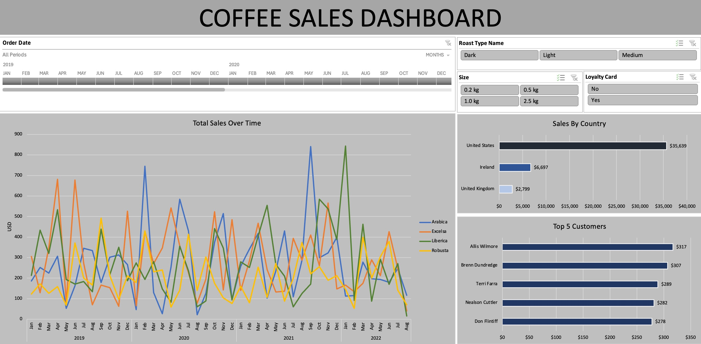

# Coffee Sales Dashboard

## 📌 Overview
The **Coffee Sales Dashboard** is an **interactive Excel dashboard** built for **data analytics** and **business intelligence**. It enables **sales performance tracking**, **customer segmentation**, and **market trend analysis** for the **global coffee market**.  
Designed with **data visualization best practices**, this project helps businesses make **data-driven decisions** by revealing sales patterns, customer behavior, and high-value market segments.

---

## 🎯 Features
- **Interactive filters** for:
  - **Order Date** (2019–2022)
  - **Roast Type** (Dark, Light, Medium)
  - **Package Size** (0.2 kg, 0.5 kg, 1.0 kg, 2.5 kg)
  - **Loyalty Card** (Yes / No)
- **Time-series sales analysis** comparing:
  - Arabica
  - Excelsa
  - Liberica
  - Robusta
- **Sales by country** visualization for:
  - United States
  - Ireland
  - United Kingdom
- **Top customers dashboard** showing **purchase value ranking** to support **retail analytics** and **customer retention strategies**.

---

## 📊 Data Insights
- **Market Leader**: The United States generated **$35,639** in revenue, leading in the **coffee retail market**.
- **Customer Segmentation**: High-value customers like **Allis Wilmore** ($317) and **Brenn Dundredge** ($307) are prime candidates for **targeted marketing campaigns**.
- **Seasonal Trends**: Clear sales peaks in specific months provide insights for **forecasting** and **inventory planning**.

---

## 🏢 Business Applications
This **Excel data analysis project** supports:
- **Sales performance tracking** – Monitor trends and compare coffee varieties.
- **Customer analytics** – Group customers by spending patterns.
- **Market expansion analysis** – Identify underperforming regions with growth potential.
- **Retail marketing insights** – Align promotions with seasonal demand and top buyer behavior.

---

## 🛠 Tools & Technologies
- **Microsoft Excel**: PivotTables, PivotCharts, Slicers, Conditional Formatting.
- **Data cleaning** and preparation for accurate reporting.
- **Data visualization** optimized for quick insights and professional reporting.

---

## 🚀 How to Use
1. Open the Coffee Sales Dashboard in **Excel 2019 or later**.
2. Use the slicers to filter by **date**, **roast type**, **package size**, or **loyalty status**.
3. Explore **interactive data visualizations** to uncover sales trends and high-value customers.
4. Export the filtered dashboard for **business reports** or **presentations**.

---

## 📸 Screenshot
Below is a preview of the **Coffee Sales Dashboard**:

---

**Author:** Alvin Jasper Juan  
**Category:** Data Analytics / Business Intelligence / Excel Dashboard

